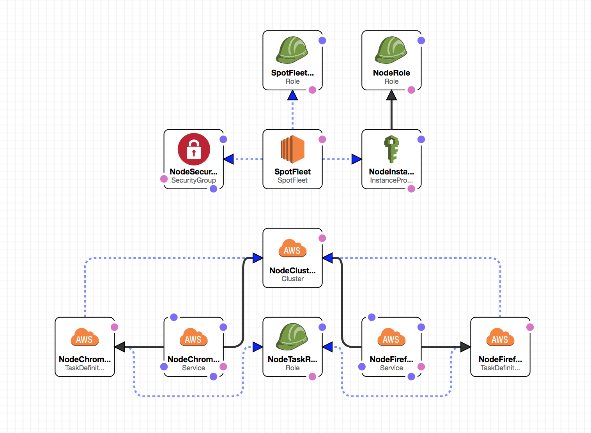

ecs-selenium
=========

## Introduction

`ecs-selenium` includes CloudFormation scripts for a reference implementation of a [Selenium Grid](https://github.com/SeleniumHQ/selenium/wiki/Grid2) running on [Amazon's EC2 Container Service](https://aws.amazon.com/ecs/).

## Design

The reference implementation consists of two ECS Clusters. A cluster for the hub, and another for the nodes.

The reasoning behind this is that we wouldn't want the hub competing with the nodes for resources, nor would we want a SpotFleet pricing mismatch to take down the Hub.

### The Hub


The Hub consists of a single instance and an ECS Cluster with a selenium server running in _hub_ mode (`-role hub`) for each node type (Firefox, Chrome). An [Application Load Balancer](http://docs.aws.amazon.com/elasticloadbalancing/latest/application/introduction.html) sits in front of it. The ALB uses the hostname prefix to route requests to the correct hub.

### The Nodes



The nodes component of the stack consists of an ECS Cluster with a couple of services, task definitions (one of each for Firefox, and Chrome), and a [Spot Fleet](http://docs.aws.amazon.com/AWSEC2/latest/UserGuide/spot-fleet.html) to provide the underlying hardware.

> *Note:* An AutoScaling Group is also provided as fall-back; in case Spot Fleet doesn't fit your needs. All you need to do is scale it up.

## Selenium

### Configuration

Setup all environments, before you start

```bash
# setup environment
cp .env.sample .env
```

Replacing the parameters with appropriate values:

```
AWS_ACCOUNT_ID=<account_id>
AWS_REGION=<region>

ECS_SELENIUM_STACK_NAME=ecs-selenium
ECS_SELENIUM_VPC_ID=<vpc-########>
ECS_SELENIUM_KEY_PAIR_NAME=<########>
ECS_SELENIUM_SUBNET_IDS=<subnet-############,subnet-############>
ECS_SELENIUM_HUB_INSTANCE_TYPE=t3.medium
ECS_SELENIUM_NODE_INSTANCE_TYPE=c5.xlarge
ECS_SELENIUM_ADMIN_CIDR=<cidr_for_admin_access: #.#.#.#/#>
ECS_SELENIUM_DESIRED_FLEET_CAP=<#>
ECS_SELENIUM_DESIRED_CHROME_NODES=<#>
ECS_SELENIUM_DESIRED_FIREFOX_NODES=<#>
ECS_SELENIUM_DOMAIN_NAME=<company.com>
ECS_SELENIUM_CHROME_IMAGE=<location_of_your_ecs-node-chrome_image>
ECS_SELENIUM_FIREFOX_IMAGE=<location_of_your_ecs-node-firefox_image>
ECS_SELENIUM_FIREFOX_REPOSITORY_IMAGE=ecs-node-firefox
ECS_SELENIUM_FIREFOX_REPOSITORY_VERSION=<numerical_version_number>
ECS_SELENIUM_CHROME_REPOSITORY_IMAGE=ecs-node-chrome
ECS_SELENIUM_CHROME_REPOSITORY_VERSION=<numerical_version_number>
```

### Create the ECR Repositories

Create your repositories before building the images. These commands only need to be run once.

```
# create the Firefox ECR repository
make ecr-create-firefox-node

# create the Chrome ECR repository
make ecr-create-chrome-node
```

### Build the Images

You now need to build and push the node images to your docker registry. ECR is assumed by default.
You can rebuild your images periodically to get newer browsers in your cluster.
You can use latest in the ECS_SELENIUM_CHROME_REPOSITORY_VERSION and ECS_SELENIUM_FIREFOX_REPOSITORY_VERSION but it will make ecr messy, images are automatically tagged as latest everytime you push a new image so we reccomend using the version number on dockerhub for the image version.

```bash

# login to ecr
make ecr-login

# build and push firefox
cd docker/ecs-node-firefox
make push

# build and push chrome
cd docker/ecs-node-chrome
make push
```

## Setup

To get a Selenium Grid up and running with ECS, run the following command:

```bash
make create-stack
```

To update Selenium Grid, run:

```bash
make update-stack
```

## Scaling

### Up

The hub handles the scaling of the node services dynamically by comparing the hub's slot availability and the number of tasks that are queued in the corresponding hub. Scaling up is done every two minutes.

Keep in mind that _only_ the number of desired tasks for the service are scaled, and it depends on the EC2 instance infrastructure being readily available.

### Down

The template includes a parameter for setting up a time to scale down the number of nodes back to the default desired capabilities. By default, it is setup to scale down at 12AM UTC. You can update the `ScaleDownCron` parameter with values that work for your timezone.

### Manual Scaling

Additionally you can manually scale the services via API calls:

```bash
# chrome
make count=<#> update-chrome-desired

# firefox
make count=<#> update-firefox-desired
```

## Making small changes

If your grid is already up and running you may want to consider using changesets to upgrade to make the small change instead of using update stack. 

By using a changeset you can make a small change to the cloudformation template and check what resources will be changed.

This should be useful for updating images. 

## Using the Grid

The template creates a Route53 hosted zone that can be used inside your VPC. By default, it uses the `example.com` domain name. You can change that by updating the `DomainName` parameter.

Inside your VPC, hosts can connect to the hubs using the following endpoints:

* `firefox.example.com:4444`
* `chrome.example.com:4444`

The ALB uses the domain name prefix to redirect to the proper hub. Domains starting with `firefox.*` will hit the Firefox hub; domains starting with `chrome.*` will hit the Chrome one.

## Troubleshooting
### Errors that occur when creating the stack
`Service arn:aws:ecs:us-west-1:1234567890:service/ecs-node-firefox did not stabilize.`

We've seen this in situations where the cluster is unable to provision the desired amount of nodes. There will be a mismatch between the Desired tasks value and the Running tasks value in the ECS console (Elastic Container Service -> ecs-selenium-nodes -> Services (tab).

It's usually due to hardware capacity. Here's what I would check:

* Did you actually get any spot instances? (EC2 -> Spot Requests -> Capacity Column (in the table)
If you didn't get any instances, your bid price may be too low for the region. You can update the MaxSpotBidPrice parameter to something that works for you. (The default is set pretty low, so depending on the region, you may be outbid by others.)

* You can look at the SpotFleet's History tab, and it will tell you if it was unable to provision instances due to your bid being too low.

* Do you have enough EC2 capacity for the number of nodes you desire?
MemoryReservation is set to 1024 per node. So you'd need 1024 MB * Number of Desired Nodes for it to provision successfully.
If you don't have enough instances for your nodes, you can increase DesiredFleetCapacity to match it, or you can decrease DesiredChromeNodes and DesiredFirefoxNodes to a number that fits within your provisioned instances.

* The fact that you don't have any entries in the ecs-selenium-nodes stream seems to indicate that it never provisioned a single node. So I'd start by looking at the SpotFleet.

### Check Cloudwatch for errors reported to the ecs-selenium logstream
