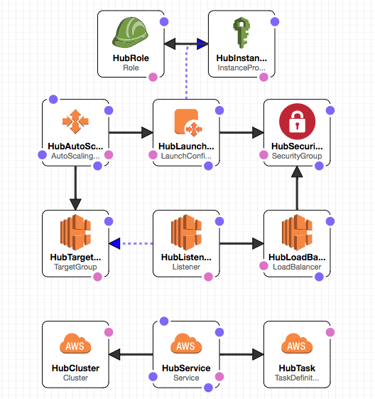

ecs-selenium
=========

## Introduction

`ecs-selenium` includes CloudFormation scripts for a reference implementation of a [Selenium Grid](https://github.com/SeleniumHQ/selenium/wiki/Grid2) running on [Amazon's EC2 Container Service](https://aws.amazon.com/ecs/).

## Design

The reference implementation consists of two ECS Clusters. A cluster for the hub, and another for the nodes.

The reasoning behind this is that we wouldn't want the hub competing with the nodes for resources, nor would we want a SpotFleet pricing mismatch to take down the Hub.

### The Hub



The Hub consists of a single instance and an ECS Cluster with a selenium server running in _hub_ mode (`-role hub`) for each node type (Firefox, Chrome). An [Application Load Balancer](http://docs.aws.amazon.com/elasticloadbalancing/latest/application/introduction.html) sits in front of it. The ALB uses the hostname prefix to route requests to the correct hub.

### The Nodes


The nodes component of the stack consists of an ECS Cluster with a couple of services, task definitions (one of each for Firefox, and Chrome), and a [Spot Fleet](http://docs.aws.amazon.com/AWSEC2/latest/UserGuide/spot-fleet.html) to provide the underlying hardware.

> *Note:* An AutoScaling Group is also provided as fall-back; in case Spot Fleet doesn't fit your needs. All you need to do is scale it up.

## Selenium

In order to get selenium working with this ECS stack, a customized version of the server with support for the `-remoteHost` flag is required. This allows the nodes to report the host's IP and container port mapping to the hub.

A PR ([selenium#4027](https://github.com/SeleniumHQ/selenium/pull/4027)) was submitted to the selenium project with support for the flag. It is already merged, and should be available in their containers starting with version `3.7.0`. Until a docker image is released by the selenium team with support for the flag, building the customized version is required.

### Building Selenium

```bash
cd docker/common/
make dist

# when it's done, there should be a patched selenium server in 'docker/common'
```

### Building the Images

You now need to build and push the node images to your docker registry. ECR is assumed by default.

```bash
# login to ecr
$(aws ecr get-login --region <region> --no-include-email)

# firefox
cd docker/ecs-node-firefox
make push ACCOUNT_ID=123456789012 REGION=<region>

# chrome
cd docker/ecs-node-chrome
make push ACCOUNT_ID=123456789012 REGION=<region>
```

## Setup

To get a Selenium Grid up and running with ECS, run the following command (replacing the parameters with appropriate values):

```bash
aws cloudformation (create-stack|update-stack) \
--stack-name "ecs-selenium" --capabilities CAPABILITY_NAMED_IAM \
--template-body file://./cloudformation/ecs-selenium.cfn.yml \
--parameters ParameterKey=VpcId,ParameterValue="<vpc-########>" \
             ParameterKey=KeyName,ParameterValue="<keypair>" \
             ParameterKey=SubnetIds,ParameterValue="<subnet--########>,<subnet-########>,..." \
             ParameterKey=HubInstanceType,ParameterValue="c4.xlarge" \
             ParameterKey=NodeInstanceType,ParameterValue="c4.xlarge" \
             ParameterKey=AdminCIDR,ParameterValue="<cidr_for_admin_access>" \
             ParameterKey=DesiredFleetCapacity,ParameterValue="<#>" \
             ParameterKey=DesiredChromeNodes,ParameterValue="<#>" \
             ParameterKey=DesiredFirefoxNodes,ParameterValue="<#>" \
             ParameterKey=NodeFirefoxImage,ParameterValue="<location_of_your_ecs-node-firefox_image>" \
             ParameterKey=NodeChromeImage,ParameterValue="<location_of_your_ecs-node-chrome_image>"
```


## Scaling

### Up

The hub handles the scaling of the node services dynamically by comparing the hub's slot availability and the number of tasks that are queued in the corresponding hub. Scaling up is done every two minutes.

Keep in mind that _only_ the number of desired tasks for the service are scaled, and it depends on the EC2 instance infrastructure being readily available.

### Down

The template includes a parameter for setting up a time to scale down the number of nodes back to the default desired capabilities. By default, it is setup to scale down at 12AM UTC. You can update the `ScaleDownCron` parameter with values that work for your timezone.

### Manual Scaling

Additionally you can manually scale the services via API calls:

```bash
# chrome
aws ecs update-service --cluster ecs-selenium-nodes --service ecs-node-chrome --desired-count <#>

# firefox
aws ecs update-service --cluster ecs-selenium-nodes --service ecs-node-firefox --desired-count <#>
```

## Using the Grid

The template creates a Route53 hosted zone that can be used inside your VPC. By default, it uses the `example.com` domain name. You can change that by updating the `DomainName` parameter.

Inside your VPC, hosts can connect to the hubs using the following endpoints:

* `firefox.example.com:4444`
* `chrome.example.com:4444`

The ALB uses the domain name prefix to redirect to the proper hub. Domains starting with `firefox.*` will hit the Firefox hub; domains starting with `chrome.*` will hit the Chrome one.
